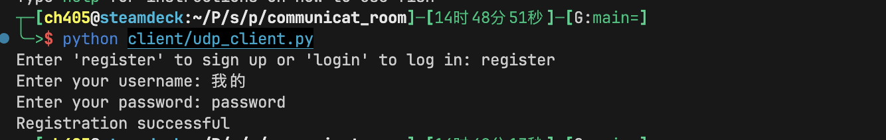
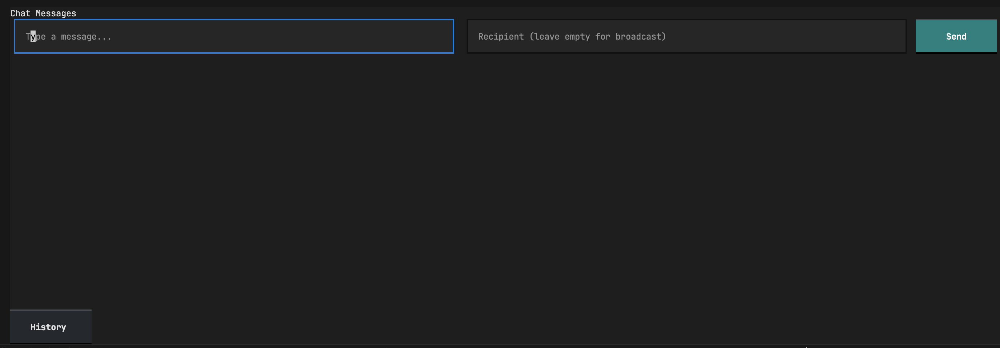
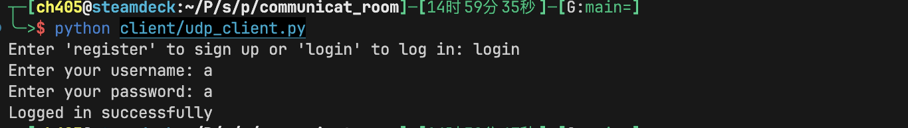
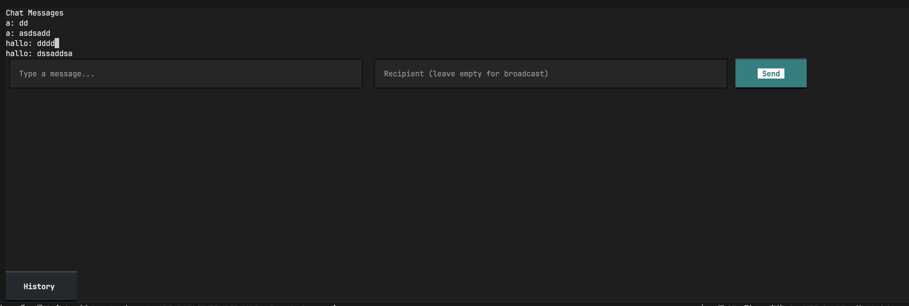

# 基于 udp 的 tui 聊天室 - 网络编程实验课

## 1. 项目简介

本项目是一个基于 udp 协议的 tui 聊天室，支持多人同时在线聊天。项目使用 python 语言编写，使用了 socket、textual 等模块,采用 redis 数据库存储用户信息。

## 2. 项目功能

### 客户端

#### 用户注册

输入`register`命令，按照提示输入用户名和密码，即可注册，注册成功自动跳转到聊天界面。

#### 用户登录

输入`login`命令，按照提示输入用户名和密码，即可登录，登录成功自动跳转到聊天界面。

#### public 聊天

不填写 recipient，即可发送消息给所有在线用户。

#### private 聊天

填写 recipient，即可发送消息给指定用户。

